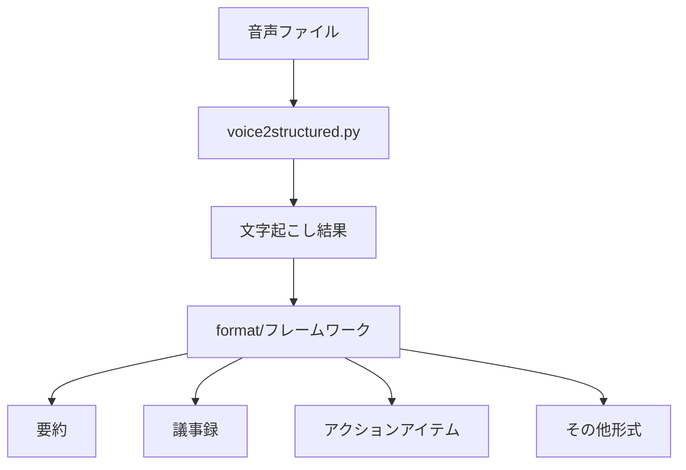
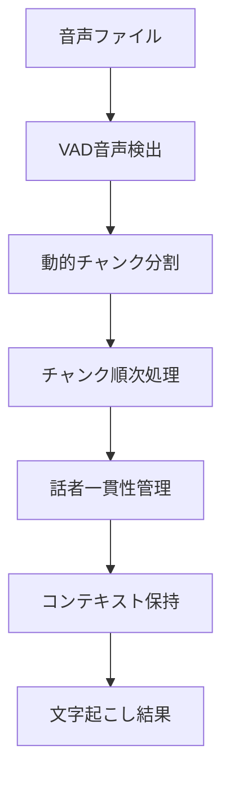
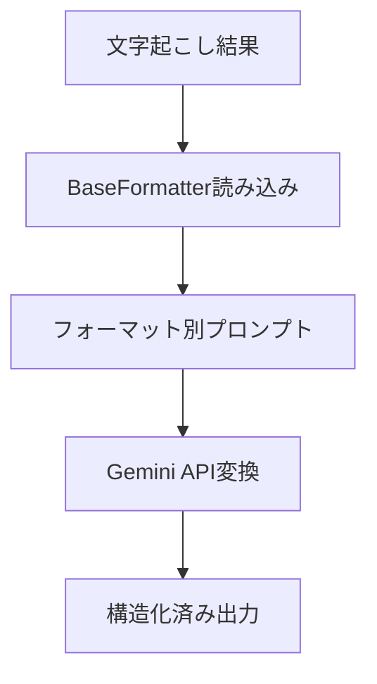

# voice2structured: 音声文字起こし＋構造化変換パイプライン

## 🎯 概要

音声ファイルから文字起こしを行い、その結果を様々な形式に構造化変換するパイプラインです。

### アーキテクチャ設計

**責任の分離**により、高品質で拡張性の高いシステムを実現：

- **`voice2structured.py`**: 音声の文字起こし専用（音声処理に特化）
- **`format/`**: 文字起こし結果の構造化変換（文書処理に特化）

## 🏗️ システム構成



## 🚀 主要機能

### 文字起こし機能（voice2structured.py）

- **2 つのモード**
  - `transcript`: 講演・会議の正確な文字起こし（相対時間表示）
  - `lifelog`: 日常音声から行動推論を含む記録（実時間表示対応）
- **話者一貫性管理**: チャンク間での話者の継続性保持
- **最適化されたチャンク分割**: 8-12 分の安全なサイズで API 制限と安全性フィルターを回避
- **強化されたエラーハンドリング**: インテリジェントリトライ、安全性フィルター対応
- **処理品質の可視化**: 成功率、部分処理、失敗統計をリアルタイム表示
- **中断・再開機能**: 長時間音声の処理中断から再開可能

### 構造化変換機能（format/）

- **要約生成**: 重要ポイントの抽出・要約
- **議事録作成**: 会議の正式な議事録形式
- **アクションアイテム抽出**: 今後の行動項目の整理
- **拡張可能**: 新しいフォーマットを簡単に追加

## 💻 使用方法

### 1. 基本的な文字起こし

```bash
# 全文文字起こし（デフォルト）
python voice2structured.py audio.wav --mode transcript

# ライフログモード（実時間表示対応）
python voice2structured.py 2025-06-28_02_40_22.mp3 --mode lifelog
```

> **💡 Tip**: ライフログモードでは、ファイル名が `YYYY-MM-DD_HH_MM_SS` 形式の場合、実際の時刻で表示されます

### 2. 構造化変換

```bash
# 要約生成
python -m format.cli summary transcript.md

# 議事録作成
python -m format.cli minutes transcript.md

# アクションアイテム抽出
python -m format.cli action_items transcript.md

# 全形式を一括処理
python -m format.cli all transcript.md
```

### 3. ワンライナーでの完全処理

```bash
# 文字起こし → 全形式変換
python voice2structured.py audio.wav && \
python -m format.cli all ./outputs/*/transcript.md
```

## 📁 プロジェクト構造

```
transcript/
├── voice2structured.py      # 音声文字起こしメイン
├── prompts_transcript.py    # 文字起こし用プロンプト
├── prompts_lifelog.py      # ライフログ用プロンプト
├── config.yaml             # 設定ファイル
├── requirements.txt        # 依存関係
└── format/                 # 構造化変換フレームワーク
    ├── __init__.py         # フレームワーク初期化
    ├── base_formatter.py   # 基底クラス
    ├── summary.py          # 要約生成
    ├── minutes.py          # 議事録作成
    ├── action_items.py     # アクションアイテム抽出
    ├── cli.py             # 統合CLIツール
    └── README.md          # format使用方法
```

## 🔧 セットアップ

### 1. 依存関係のインストール

```bash
pip install -r requirements.txt
```

### 2. 環境変数の設定

```bash
export GOOGLE_API_KEY="your_gemini_api_key"
```

### 3. 設定ファイルの準備

```bash
cp config.yaml.example config.yaml
# config.yamlを編集
```

## 📊 出力例

### 文字起こし結果（voice2structured.py）

**📝 Transcript モード（相対時間表示）**

```markdown
# 音声文字起こし

## 処理情報

- 処理日時: 2024-12-01 14:30:00
- モデル: gemini-2.5-flash
- チャンク数: 3
- 処理モード: 全文文字起こし
- 識別された話者数: 2
- 処理品質: ✅ 成功 3, ⚠️ 部分 0, ❌ 失敗 0 (成功率: 100.0%)

## 話者一覧

- **A さん**: チャンク 0 で初登場
- **B さん**: チャンク 1 で初登場

## 文字起こし内容

### [00:00 - 02:30]

A さん: こんにちは、今日はよろしくお願いします。
B さん: こちらこそ、よろしくお願いします。
```

**🎯 Lifelog モード（実時間表示）**

```markdown
# ライフログ記録

## 処理情報

- 処理日時: 2024-12-01 14:30:00
- 処理モード: ライフログ

## 時系列ライフログ

### [02:40:22 - 02:42:52]

[02:40:22] (行動: 外出準備と思われる。キーやカバンの音)
[02:40:45] 本人: おはよう、今日も頑張ろう
[02:41:15] (行動: ドアを開けて外出。足音から歩き始め)
[02:42:30] (環境音: 車のエンジン音、交通音から道路付近)
```

> **💡 ライフログの実時間表示機能**
>
> ファイル名が `YYYY-MM-DD_HH_MM_SS.mp3` 形式の場合、音声開始時刻を自動抽出し、実際の時刻で表示します。
>
> - **例**: `2025-06-28_02_40_22.mp3` → 2025 年 6 月 28 日 02:40:22 開始
> - **相対時間**: `150秒地点` → `02:30` (transcript モード)
> - **実時間**: `150秒地点` → `02:42:52` (lifelog モード)
>
> パターンに一致しないファイル名の場合は、従来通り相対時間で表示されます。

### 要約結果（format/summary）

```markdown
# 音声文字起こし - 要約

## 全体要約

プロジェクトの進捗確認と次回までの作業分担について話し合いが行われた。

## 主要な議題

- プロジェクト A の進捗状況
- 次回スケジュール調整
- 担当業務の分担

## 決定事項

- 次回会議は来週火曜日に実施
- A さんが資料作成を担当
```

## 🎛️ 詳細設定

### config.yaml 設定例

```yaml
llm:
  model:
    name: "gemini-2.5-flash"
    generation_config:
      temperature: 0.1
      max_output_tokens: 8192

chunk_policy:
  min_minutes: 30
  max_minutes: 45
  target_tokens: 50000

io:
  output_dir: "./outputs/${job_id}/"
```

## 🔄 処理フロー詳細

### 1. 音声文字起こしフロー



### 2. 構造化変換フロー



## 🏆 メリット

### 音声処理の高品質化

- **集中特化**: 文字起こしに特化することで音声認識品質向上
- **コンテキスト保持**: チャンク間での話者・文脈の継続性管理

### 構造化変換の柔軟性

- **再利用性**: 1 つの文字起こしから複数形式に変換
- **拡張性**: 新しいフォーマットを簡単に追加
- **独立性**: 各変換処理は独立してテスト・デバッグ可能

### 開発・運用の効率化

- **責任分離**: 音声処理と文書処理の明確な分離
- **段階的処理**: 文字起こし → 構造化変換の段階的実行
- **デバッグ性**: 各段階の結果を個別に検証可能

## 🚧 今後の拡張予定

- **新フォーマット**:
  - 話者分析レポート
  - トピック分析
  - 感情分析
  - Q&A 抽出
- **API 化**: RESTful API での提供
- **Web UI**: ブラウザからの簡単操作
- **バッチ処理**: 複数ファイルの一括処理
