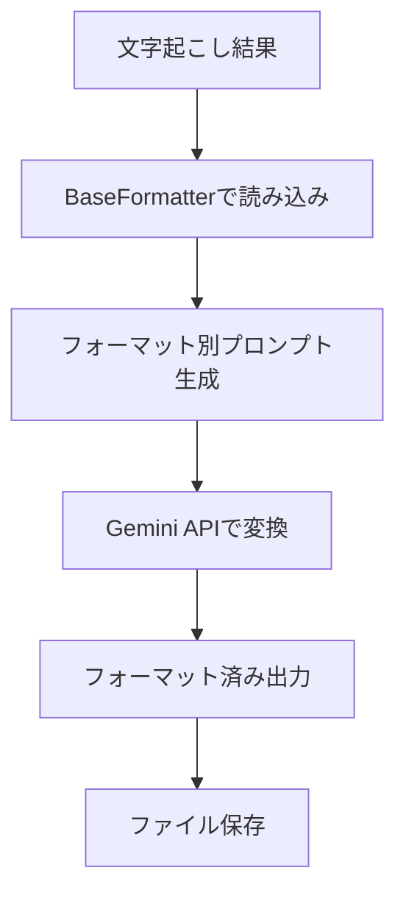

# format: 文字起こし結果構造化変換フレームワーク

## 概要

`voice2structured.py`で生成された文字起こし結果を入力として、様々な形式への構造化変換を提供するフレームワークです。

## 🎯 設計思想

- **責任の分離**: 音声処理（voice2structured.py）と文書処理（format/）を完全分離
- **拡張性**: 新しいフォーマットを簡単に追加可能
- **再利用性**: 同じ文字起こしから複数の形式に変換可能
- **モジュラー設計**: 各フォーマッターは独立して動作

## 📁 ディレクトリ構造

```
format/
├── __init__.py           # フレームワーク初期化
├── base_formatter.py     # 基底クラス
├── summary.py           # 要約生成
├── minutes.py           # 議事録作成
├── action_items.py      # アクションアイテム抽出
├── cli.py              # 統合CLIツール
└── README.md           # このファイル
```

## 🚀 利用可能なフォーマット

### 1. summary（要約生成）

文字起こし結果から重要なポイントを抽出して要約を作成します。

**出力内容:**

- 全体要約（200-300 文字）
- 主要な議題・トピック
- 重要な発言
- 決定事項
- アクションアイテム
- 次回への持ち越し

### 2. minutes（議事録作成）

会議の議事録形式にフォーマットします。

**出力内容:**

- 会議概要
- 議事内容（議題別整理）
- アクションアイテム
- 次回予定

### 3. action_items（アクションアイテム抽出）

今後の行動項目を抽出・整理します。

**出力内容:**

- 緊急度別分類（高/中/低優先度）
- 未割り当てタスク
- 継続監視項目
- 次のステップ提案

## 💻 使用方法

### 統合 CLI ツール（推奨）

```bash
# 要約生成
python -m format.cli summary transcript.md

# 議事録作成
python -m format.cli minutes transcript.md -o meeting_minutes.md

# アクションアイテム抽出
python -m format.cli action_items transcript.md

# 全形式を一括処理
python -m format.cli all transcript.md --output-dir ./formatted/
```

### 個別モジュール実行

```bash
# 要約生成
python -m format.summary transcript.md

# 議事録作成
python -m format.minutes transcript.md

# アクションアイテム抽出
python -m format.action_items transcript.md
```

### Python API として使用

```python
from format import SummaryFormatter, MinutesFormatter, ActionItemsFormatter

# 要約生成
summary_formatter = SummaryFormatter()
summary_path = summary_formatter.format("transcript.md")

# 議事録作成
minutes_formatter = MinutesFormatter()
minutes_path = minutes_formatter.format("transcript.md", "meeting_minutes.md")

# アクションアイテム抽出
action_formatter = ActionItemsFormatter()
action_path = action_formatter.format("transcript.md")
```

## 🔧 オプション

### 共通オプション

- `--model`: 使用する Gemini モデル名（デフォルト: gemini-2.5-flash）
- `-o, --output`: 出力ファイルパス（省略時は自動生成）

### 統合 CLI 専用オプション

- `--output-dir`: 出力ディレクトリ（all モード時）

## 📊 処理フロー



## 🏗️ 新しいフォーマッターの追加

新しいフォーマットを追加するには：

1. **新しいフォーマッタークラスを作成**

```python
# format/my_format.py
from .base_formatter import BaseFormatter

class MyFormatFormatter(BaseFormatter):
    def get_format_name(self) -> str:
        return "my_format"

    def format(self, transcript_path: str, output_path: Optional[str] = None) -> str:
        # 実装
        pass
```

2. **`__init__.py`に追加**

```python
from .my_format import MyFormatFormatter

__all__ = [
    "BaseFormatter",
    "SummaryFormatter",
    "MinutesFormatter",
    "ActionItemsFormatter",
    "MyFormatFormatter"  # 追加
]
```

3. **`cli.py`に統合**

```python
formatters = {
    "summary": SummaryFormatter,
    "minutes": MinutesFormatter,
    "action_items": ActionItemsFormatter,
    "my_format": MyFormatFormatter,  # 追加
}
```

## 🔗 voice2structured.py との連携

### 基本的なワークフロー

```bash
# 1. 文字起こし実行
python voice2structured.py audio.wav --mode transcript

# 2. 構造化変換実行
python -m format.cli all ./outputs/20241201_1430/transcript.md
```

### 自動化スクリプト例

```bash
#!/bin/bash
# 音声ファイルの文字起こしと構造化変換を自動実行

AUDIO_FILE=$1
if [ -z "$AUDIO_FILE" ]; then
    echo "Usage: $0 <audio_file>"
    exit 1
fi

# 文字起こし実行
echo "🎙️ 文字起こし開始..."
python voice2structured.py "$AUDIO_FILE" --mode transcript

# 最新の出力ディレクトリを取得
LATEST_OUTPUT=$(ls -td ./outputs/*/ | head -n1)
TRANSCRIPT_FILE="${LATEST_OUTPUT}transcript.md"

# 構造化変換実行
echo "📝 構造化変換開始..."
python -m format.cli all "$TRANSCRIPT_FILE" --output-dir "${LATEST_OUTPUT}formatted/"

echo "✅ 処理完了!"
echo "📁 出力ディレクトリ: $LATEST_OUTPUT"
```

## 📋 入力ファイル形式

### 対応形式

- **Markdown (.md)**: voice2structured.py の出力形式
- **JSON (.json)**: 構造化データ形式

### 期待される構造（Markdown）

```markdown
# 音声文字起こし

## 処理情報

- 処理日時: 2024-12-01 14:30:00
- モデル: gemini-2.5-flash
- チャンク数: 3
- 処理モード: 全文文字起こし
- 識別された話者数: 2

## 話者一覧

- **A さん**: チャンク 0 で初登場
- **B さん**: チャンク 1 で初登場

## 文字起こし内容

### [00:00 - 02:30]

A さん: こんにちは...
B さん: よろしくお願いします...

### [02:30 - 05:00]

...
```

## 🎛️ 環境設定

### 必要な環境変数

```bash
export GOOGLE_API_KEY="your_gemini_api_key"
```

### 必要な依存関係

```bash
pip install google-generativeai
```

## 🤝 貢献

新しいフォーマッターの追加や既存機能の改善は歓迎します。BaseFormatter クラスを継承して一貫性のある API を提供してください。

---

_このフレームワークは voice2structured.py プロジェクトの一部として開発されています。_
